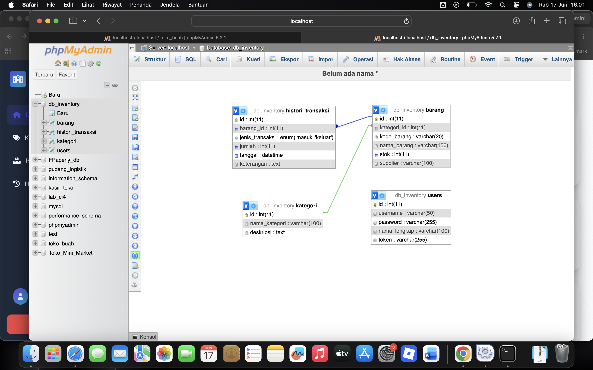
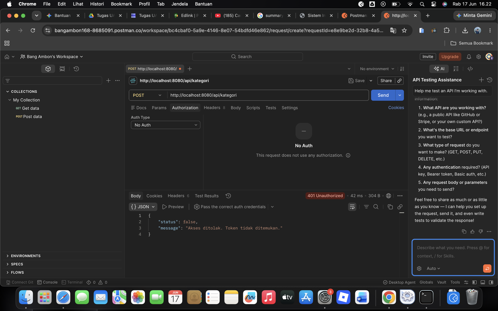
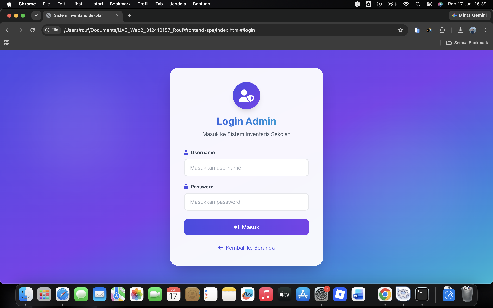
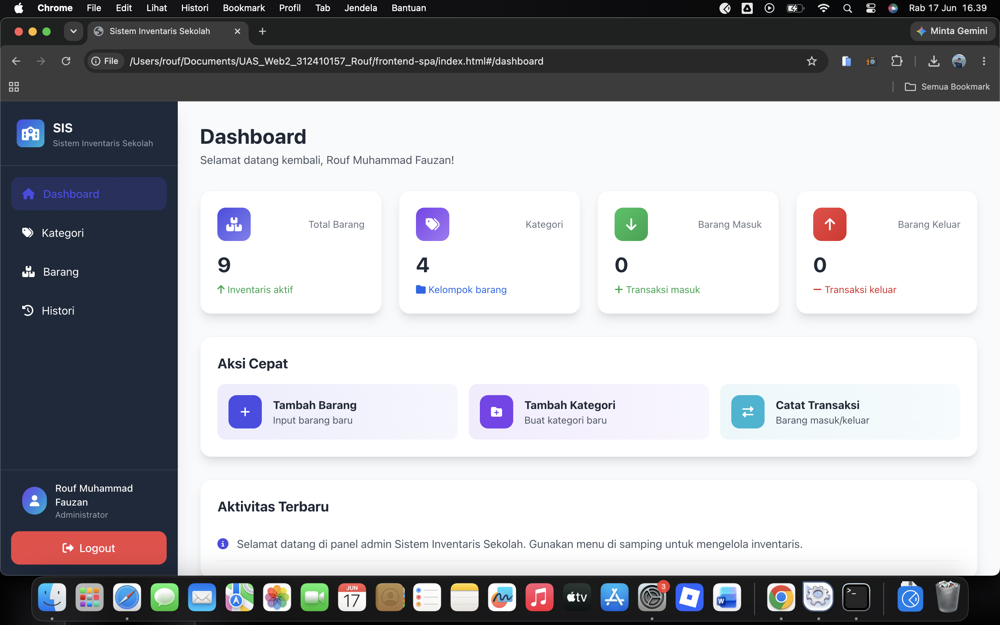
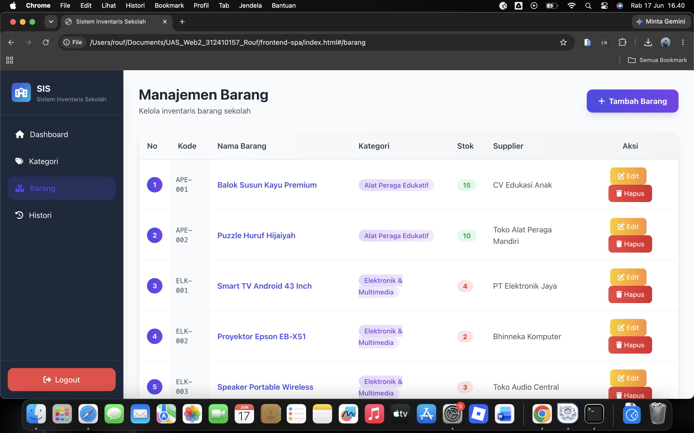
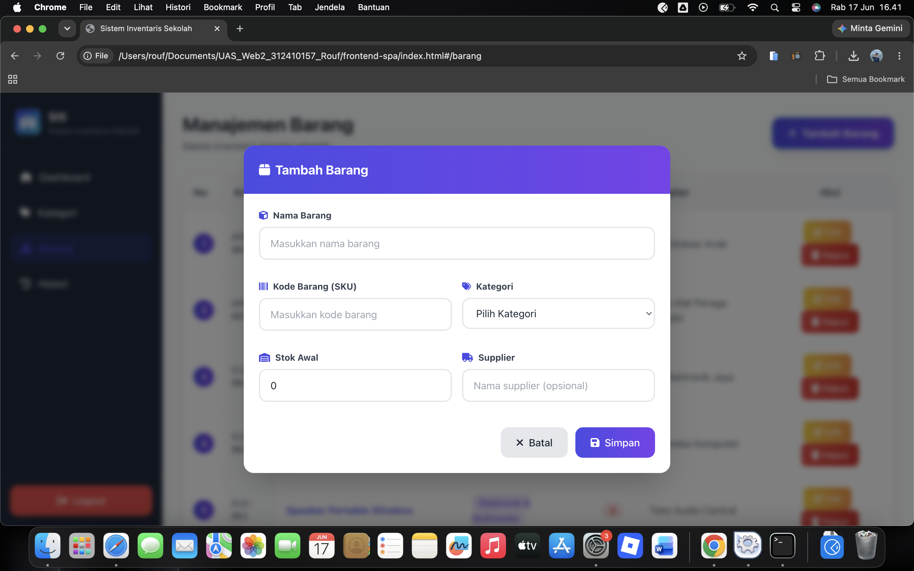

# Sistem Inventaris Sekolah (E-Inventory) 
**Proyek Ujian Akhir Semester - Pemrograman Web 2**

Sistem informasi manajemen inventaris ini dibangun dengan arsitektur *Decoupled* (terpisah) untuk mendigitalisasi pencatatan aset institusi pendidikan, meliputi pendataan barang, kategori, serta histori barang masuk dan keluar.

## 🛠 Teknologi Utama
- **Backend:** CodeIgniter 4 (RESTful API, Resource Controller, Filters untuk Token/CORS)
- **Frontend:** VueJS 3 (SPA, Vue Router), Axios (Interceptors)
- **UI:** TailwindCSS via CDN
- **Database:** MySQL

## 🚀 Panduan Instalasi
1. **Backend:** Buka terminal pada direktori `backend-api`, sesuaikan koneksi database di `.env`, lalu jalankan `php spark serve`.
2. **Frontend:** Buka direktori `frontend-spa` dan jalankan `index.html` menggunakan Live Server.
3. Akses aplikasi melalui browser dan login sebagai Administrator.

## 🔗 Tautan Penting
- **Demo Aplikasi:** [Link Video Presentasi YouTube]

## 📸 Dokumentasi Visual

### 1. Skema Relasi Database

### 2. Keamanan API (Uji Coba Error 401 via Postman)

### 3. Halaman Login

### 4. Halaman Dashboard Admin

### 5. Visualisasi Tabel Data 

### 6. Form Modal Interaktif (Tambah/Edit)

